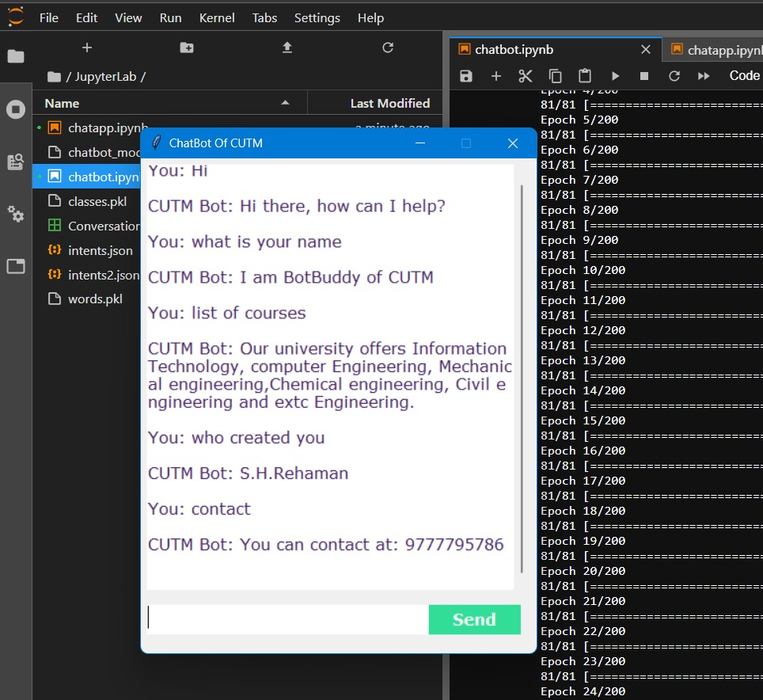

# ChatBot

This project is a chatbot that provides automated responses to user inputs. The chatbot uses a json data to and generate appropriate responses for only [CUTM](https://cutm.ac.in/) College. It can be integrated into various applications or platforms to handle user interactions.

## Table of Contents

- [Installation](#installation)
- [Contributing](#contributing)
- [Feedback and Suggestions](#feedback-and-suggestions)
## Installation

 1. Clone the repository
 2. Install the required libraries 
 3. Run The Chatbot gui file

## Contributing

Contributions are welcome! If you'd like to contribute to this project, please follow these steps:

 1. Fork the repository
 2. Create a new branch
 3. Push to the branch

## Feedback and Suggestions

If you have any feedback or suggestions for improving this chatbot, please feel free to reach out to me. You can contact me via email at s.h.rehaman.art@gmail.com or through WhatsApp [Just Say Hello 👋 ](https://api.whatsapp.com/send/?phone=919777795786&text=Hello%20Shaikh%20Habibur%20Rehaman,%20I%20get%20this%20no.%20from%20your%20Github%20&type=phone_number&app_absent=0)
